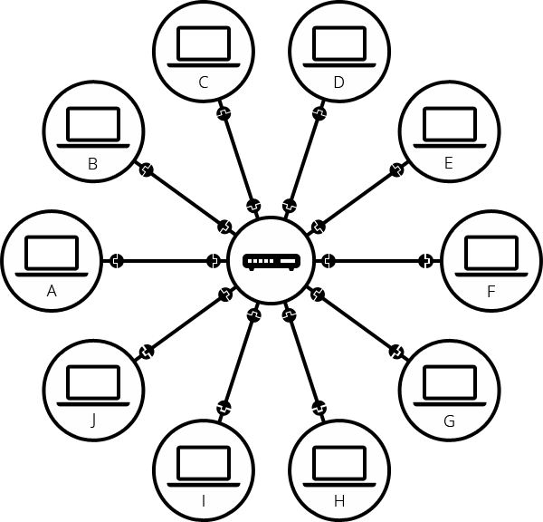

# THE ULTIMATE ARTICLE EXPLAINING THE WORKING OF THE INTERNET

Have you ever wonderd the what sort of magic is happening when you type google.com in your address bar if you don't know and want to learn all the jargon happening behind the scenes without complication and simple analogies this article is just for you.

Before going into the working of internet you have to understand what is internet

## what is internet

Internet the connection of computers which are connected with the help of wires, optical fibers, Cell Towers, Sattiltes etc .

To explain it in terms of layman terms imagine a paper cup telephone in place of paper cups there will be an computer and in place of thread there will be wires,optical fibers etc and there are more than two computers and more wires that are interconnected 

Then you might ask does google also have computer that stores information in a computer and connected to internet. The answer is yes but googles computer is a special type of computer which can run 24/7 so that it can be connected to internet 24/7 to give you information 24/7

## let's breakdown the working of internet step by step 

### connection establishment 

Any device can be connected to the computer via the wire or wireless connection provided by the Internet service provider and each device has IP Address (just like you phone no which is unique and only you have it)

### Accessing Website

when you type google.com in your address bar your browser request an I.P address (nothing but a of device unique id that is required to connect to internet) of google.com from DNS (Domain Name System) where each domain name is mapped to it's corresponding IP address this is called DNS resolution

If you have previously visited the website then the IP Address is stored in your browser and there is no need for DNS resolution

Then corresponding IP address is retrived from the DNS database and sent to the browser, now browser uses this IP address to get 
to the website

### Data Transmission

after getting the IP Address of the required website the the client request the website using IP address via the routing network which provides the optimal network path for a speedy connection with your server via the internet backbone (optical fibers,sattellite internet etc)

### Protocols

TCP/IP: The Transmission Control Protocol (TCP) and Internet Protocol (IP) are the main protocols used for data transmission.

IP: Handles the addressing and routing of packets.

TCP: Ensures that packets are delivered in the correct order and without errors.

HTTP/HTTPS: Hypertext Transfer Protocol (HTTP) and its secure version (HTTPS) are used for web communication. They define how messages are formatted and transmitted, and what actions web servers and browsers should take in response to various commands.

### Browser/App Processing 

The browser or app process the response from HTTP/HTTPS response and renders the content based on the response

