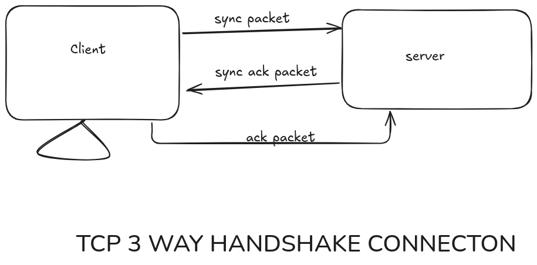

# OSI, TCP, and UDP Protocols: Easy-to-Understand Guide for Starters

Have you ever wondered how the data moves through the internet but not found a satisfiying answer this article is the go to source for a beginner to de-mistify the data movement through the internet

Entire internet works in order to move the data and entire I.T sector depends on the movement of the data and the movement of the data is based on the model OSI (Open System interconnect) model

## 7 Layers of the OSI that help to transfer the data over internet

those are

1. Physical Layer(works on bits) : This layer is responsible for the physical means of sending and receiving data between devices

2. data link layer (works on frames): This inclueds I.P frame T.C.P frame Header frame to transfer the frames data link layer transfers it to physical link layer

3. Network layer (works on packets): This does the job of routing the data (i,e.moving the data) this layer transfers the frames like I.P etc. to the data layer

4. transport layer (works on segments): This includes data transfer protocol such as T.C.P and U.D.P to tranfer data from one computer to other via the network layer

5. Session layer: This layer establishes, maintains, and terminates connections between applications running on different devices. It sets up a dialogue between applications and manages the exchange of data between them.

6. presentation layer: This layer is responsible for converting data into a format that can be understood by the receiving device. It provides functions such as data compression, encryption, and formatting, to ensure that data is presented in a consistent and readable format.

7. application layer: This layer provides services and interfaces for applications to communicate with each other. It includes protocols such as HTTP (Hypertext Transfer Protocol), FTP (File Transfer Protocol), and SMTP (Simple Mail Transfer Protocol) that enable applications to exchange data. 

session,presentation,application layer can be clubbed to form application layer

all this seven layer combine to make internet possible and this applicationd data gives data to transport layer and data keeps flowing to lower levels of hardware 

## TCP and UDP protocol

transfer protocol via TCP OR UDP lets now the diffrence between TCP and UDP protocol which has their own tradeoff 

### TCP (Transfer Control Protocol):

As the name it self suggest that the set of rules over which information is sent from one system to another

* It is reliable, and works in a orderd way and works via three way acknowledgement/handshake 

let see its working now

As of any internet communication there is client and server  

lets assume that for now that client is sending the request/information to the server this request/information is sent to the server via the data packets and this packets can arrive in any pattren or miss certain data but change in the pattren or missing of data is not desired for critical information that's where TCP and sequencing numbering of data packets and three way handshake into the picture  

key characteristics of TCP 

1. Connection-oriented: TCP establishes a connection between the sender and receiver before data is sent. This connection is established through a three-way handshake process.

2. Reliable: TCP ensures that data is delivered in the correct order and that there is no duplication or loss of data.

3. Error-checked: TCP performs error-checking on the data to ensure that it is not corrupted during transmission.

4. Ordered: TCP ensures that data is delivered in the correct order, even if packets are received out of orde

#### three way handshake 

in three way handshake as the name suggest has three steps

1. Synchronize packet : In this step the client computer send sync packet(just data packet that includes essential data for connection establishment like client's IP address->for device verification, port number-> for connection establishment, random sequence number->for security and other purpose) to the server in simple terms it is like saying 'hello i want to establish connection to you' and 

2. synchronize acknowledgement packet: when server recives synchronize packet it responds with synchronize acknowledgement packet (it's like agreeing to establish connection "Okay, I'm here! I received your request.") synchronize acknowledgement packet includes server's IP address, port number, and a random sequence number,

3. acknowledgement packet: when the client recivies synchronize acknowledgement packet it responds with saying "Great, I'm connected! Let's start communicating." The acknowledgement packet includes the client's sequence number and an acknowledgment of the server's sequence number.

THE BLOCK DIAGRAM CAN BE SEEN BELLOW

Why is it necessary?

The three-way handshake is necessary to:

. Establish a connection between the client and server
. Ensure that both devices are ready to communicate
. Synchronize the sequence numbers, which helps to prevent data corruption or loss during transmission 
. Agree on the communication parameters, such as the protocol and port numbers

Example:

Imagine you're are ordering a food item in restarent. The three-way handshake is like this:

. You look at the menu and order for an item 'mushroom chilli' (Synchronize packet)
. Your waiter answers and says "mushroom chilli that's it any thing more wana try today's special mushroom tandoori" (synchronize acknowledgement packet)
. You respond with "great i want to try that too" (acknowledgement packet)

HTTP/HTTPS `get`,`post`,`delete` request takes place on application layer and offload the data to transport layer

as you can see TCP has the overhead(extra work of establishment of three way connection) as a result threre is high reliabilty but lower speeds(latency)

### UDP (User Datagram Protocol)

The UDP method is like sending a post card to your friend you don't cross check it at least at first. the data is sent in packets and each packet is like a seperate post card sent independently and sender also doesn't wait for conformation

Key characteristics of UDP:

1.Connectionless: UDP doesn't establish a connection with the receiver before sending data. It just sends the data and hopes it arrives.

2.No guarantee of delivery: UDP doesn't guarantee that the packets will be delivered. If a packet gets lost, it's not re-sent.

3.No order guarantee: UDP packets may arrive out of order. The receiver has to put them back in the correct order.

4.Fast: UDP is faster than other protocols because it doesn't have the overhead of establishing connections and guaranteeing delivery.

widly used in online streaming,gaming etc where speed is requirement where some data loss is acceptable and but slow speed is not